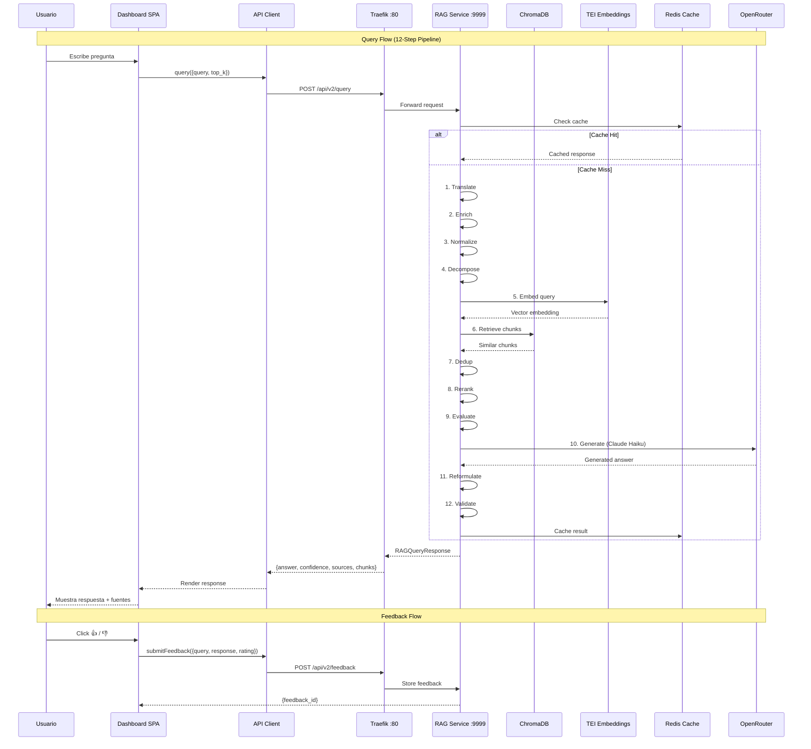

# Frontend Dashboard - Arquitectura de Navegación

## Diagrama de Módulos y Endpoints

```mermaid
graph TB
    subgraph "🌐 Envios23 RAG Dashboard"
        NAV[Navigation Bar]
        
        subgraph "💬 Chat & Evaluación"
            CHAT[Chat Interface]
            EVAL[Evaluación Side-by-Side]
            PROMPT_SEL[Selector de Prompts]
            STREAM[Streaming SSE]
        end
        
        subgraph "📄 Knowledge Base"
            DOC_LIST[Lista de Documentos]
            DOC_UPLOAD[Upload / Drag & Drop]
            DOC_DETAIL[Detalle Documento]
            DOC_REINDEX[Reindexar]
            INBOX[Scan Inbox]
            SYNC[Sync Directorio]
        end
        
        subgraph "🏢 Tenants"
            TEN_LIST[Lista de Tenants]
            TEN_CREATE[Crear Tenant]
            TEN_EDIT[Editar Config]
            TEN_DELETE[Eliminar Tenant]
        end
        
        subgraph "🤖 Agents"
            AGT_LIST[Lista de Agentes]
            AGT_CREATE[Crear Agente]
            AGT_CONSOLE[Console Agente]
            AGT_INGEST[Ingestor Agente]
        end
        
        subgraph "📊 Analytics"
            HEALTH[Health Overview]
            FB_STATS[Feedback Stats]
            KB_STATS[KB Stats]
            CACHE_STATS[Cache Stats]
            FB_REVIEW[Review Queue]
        end
        
        subgraph "⚙️ Admin"
            MCP_EXPLORE[MCP Explorer]
            CACHE_MGT[Cache Management]
            MODELS[Modelos]
            RESET[Reset & Reindex]
        end
    end
    
    subgraph "🔌 API Endpoints (/api/v2/)"
        E_QUERY[POST /query]
        E_INGEST[POST /ingest]
        E_STATS[GET /stats]
        E_CACHE[DELETE /cache]
        E_HEALTH[GET /health]
        
        E_AGENTS[/agents/*]
        E_REGISTRY[/registry/*]
        E_TENANTS[/tenants/*]
        E_MCP[/mcp/*]
        E_FEEDBACK[/feedback/*]
        E_CHAT[/chat/completions]
        E_MODELS[GET /models]
    end
    
    CHAT --> E_MCP
    CHAT --> E_QUERY
    EVAL --> E_QUERY
    EVAL --> E_CHAT
    STREAM --> E_CHAT
    PROMPT_SEL --> E_MCP
    CHAT --> E_FEEDBACK
    
    DOC_LIST --> E_REGISTRY
    DOC_UPLOAD --> E_REGISTRY
    DOC_DETAIL --> E_REGISTRY
    DOC_REINDEX --> E_REGISTRY
    INBOX --> E_REGISTRY
    SYNC --> E_REGISTRY
    
    TEN_LIST --> E_TENANTS
    TEN_CREATE --> E_TENANTS
    TEN_EDIT --> E_TENANTS
    TEN_DELETE --> E_TENANTS
    
    AGT_LIST --> E_AGENTS
    AGT_CREATE --> E_AGENTS
    AGT_CONSOLE --> E_AGENTS
    AGT_INGEST --> E_AGENTS
    
    HEALTH --> E_HEALTH
    FB_STATS --> E_FEEDBACK
    KB_STATS --> E_REGISTRY
    KB_STATS --> E_STATS
    CACHE_STATS --> E_STATS
    FB_REVIEW --> E_FEEDBACK
    
    MCP_EXPLORE --> E_MCP
    CACHE_MGT --> E_CACHE
    MODELS --> E_MODELS
    RESET --> E_REGISTRY
```

## Flujo de Datos



## Wireframe: Dashboard Principal

```
╔═══════════════════════════════════════════════════════════════════╗
║  📦 Envios23 RAG Dashboard          🔔 ⚡ healthy    [👤 Admin] ║
╠═══════╦═══════════════════════════════════════════════════════════╣
║       ║                                                           ║
║  💬   ║  ┌──────────┐┌──────────┐┌──────────┐┌──────────┐       ║
║ Chat  ║  │ 📄 12    ││ 🧩 847   ││ 👍 85%   ││ ⚡ 72ms  │       ║
║       ║  │Documents ││ Chunks   ││Satisf.   ││Avg Time  │       ║
║  📄   ║  └──────────┘└──────────┘└──────────┘└──────────┘       ║
║ Docs  ║                                                           ║
║       ║  ┌─────────────────────────┐┌────────────────────────┐   ║
║  🏢   ║  │                         ││  Recent Queries        │   ║
║Tenant ║  │  Feedback Trend         ││                        │   ║
║       ║  │  ▁▂▃▅▇▅▃▂▁▂▃▅▇█       ││  • ¿Cómo envío a...? │   ║
║  🤖   ║  │                         ││  • Regulaciones de...  │   ║
║Agent  ║  │  positive ████████ 85%  ││  • Precios de...       │   ║
║       ║  │  negative ██░░░░░░ 15%  ││                        │   ║
║  📊   ║  │                         ││                        │   ║
║Stats  ║  └─────────────────────────┘└────────────────────────┘   ║
║       ║                                                           ║
║  ⚙️   ║  ┌─────────────────────────┐┌────────────────────────┐   ║
║Admin  ║  │  Services Health        ││  Unreviewed Feedback   │   ║
║       ║  │                         ││                        │   ║
║       ║  │  ✅ RAG API    healthy  ││  ⚠️ 5 pending reviews  │   ║
║       ║  │  ✅ ChromaDB   healthy  ││                        │   ║
║       ║  │  ✅ Redis      healthy  ││  [Review Now →]        │   ║
║       ║  │  ✅ TEI        healthy  ││                        │   ║
║       ║  └─────────────────────────┘└────────────────────────┘   ║
╚═══════╩═══════════════════════════════════════════════════════════╝
```
